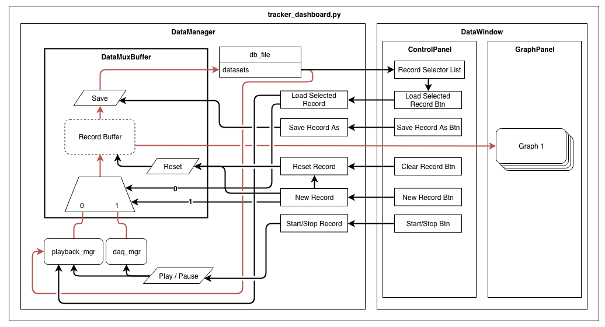

# Doppler Radar Dashboard

The goal of this project is to demonstrate a robust 3D tracking system utilizing low-cost, miniaturized, doppler radar modules.

## Requirements

Due to the NIDAQmx hardware used for data acquisition, at this time, only Windows is supported for real-time data acquisition.  Data-playback from an HDF5 database and "fake-daq" is still available (fake-daq generates data that looks similar to the radar array with no motion detected).

Additionally, Anaconda must be installed on the host machine to allow for the environment to be properly configured.

## Packages

This project uses [Anaconda](https://conda.io/docs/) Python environment manager to manage the environment, and packages for this project.  If Anaconda has not been installed, first install this from the [Anaconda project website](https://conda.io/miniconda.html).

Once isntalled, the environment can be configured by navigating to the project root directory and typing: `conda create --name <env_name> --file requirements.txt`

### Package Background

This software relies heavily on `numpy`, `nidaqmx`, `PyQt5`, `PyQtGraph`, and `h5py` packages. Moreover, this project uses Intel optimized packages and therefore will run more efficiently on an Intel-based platform.  More information can be found on these packages at the following links:

-   [numpy](https://docs.scipy.org/) – scientific computing
-   [nidaqmx](https://nidaqmx-python.readthedocs.io/en/latest/) – Data Acquisition using NI DAQ
-   [PyQt4](http://pyqt.sourceforge.net/Docs/PyQt4/) – GUI Interface
-   [PyQtGraph](http://pyqtgraph.org/) – Real-time graphing tools using Qt
-   [h5py](https://www.h5py.org/) – Large database storage

## Database Implementation

The layout of the database used in this project is described by the tree below.  A `/` indicates a `group`, `(parenthesis)` represent an `attribute`, `[square brackets]` represent a `dataspace`, `{curly braces}` represent a `datatype`, and all others are `datasets`.

Sample attributes include:
- label
  - Class label of recording
- notes
  - Any extra arbitrary text required to describe the sample
- subject
  - Name of subject being recorded
  - Fomat: first_last
- sample_rate
  - Sampling rate of the ADC used in the recording
- sample_chunk_size
  - Size of sample on each channel used when sampling

```
/root
|--/samples
|    |--sample_0[8x2xsample_chunk_size]{H5T_IEEE_F32BE}
|    |    |--(label){string}
|    |    |--(notes){string}
|    |    |--(subject){string}
|    |    |--(sample_rate){H5T_IEEE_I32BE}
|    |    +--(sample_chunk_size){H5T_IEEE_I32BE}
|    :
|
|--/labels  ### contains aliases of samples -- Not yet implimented ###
|    |--/label_0
|    |    |--sample_0[8x2xsample_chunk_size]{H5T_IEEE_F32BE}
|    |    |   |--sample_rate(uint_32)
|    |    |   +--sample_chunk_size(uint_16)
|    |    |
:    :    :
```

All database functions are located in `data_mgr.py` and all user interface/controls, such as save/load, new class, etc., are located in `gui_panels.py`.

## Data-Flow Graph

Somewhat obsolete


